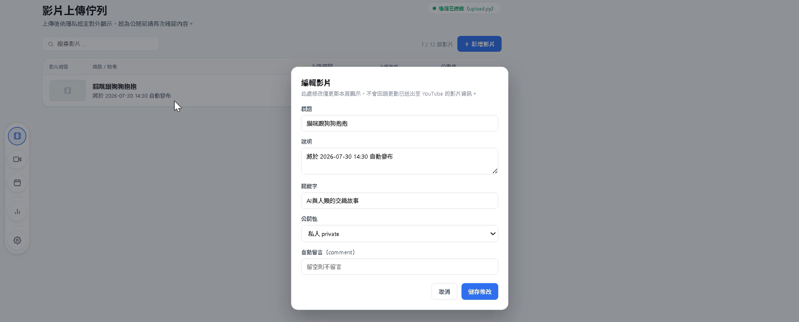
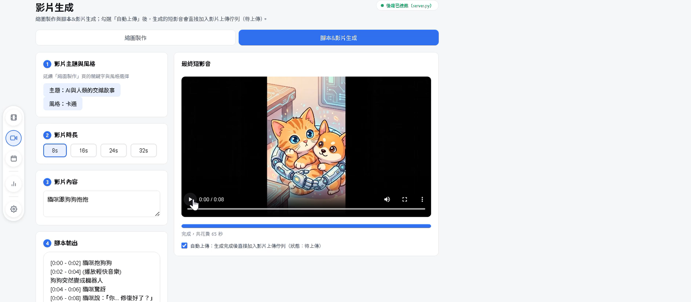
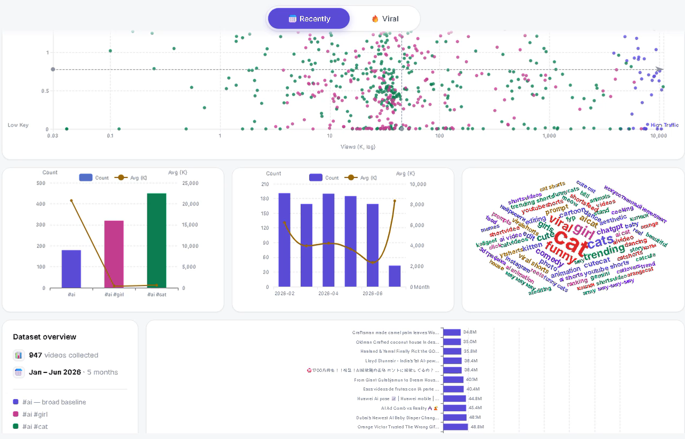

# DogsOut

AI 短影音自動化生產線：從 **YouTube Shorts 趨勢分析** → **縮圖生成** → **腳本撰寫** → **影片生成** → **排程上傳與自動留言**，全部整合在同一個 FastAPI 服務與網頁面板中，並可透過 Telegram Bot 遠端查詢狀態。

---

## 功能總覽

| 模組 | 目錄 | 功能 |
|---|---|---|
| 數據分析 | `data/` | 用 YouTube Data API 蒐集熱門 Shorts，翻譯、抽關鍵字、分群，產生可視化分析頁 |
| 影片製作 | `video/` | Gemini 生成縮圖、qwen3 串流生成腳本、Gemini (Veo) 生成短影音 |
| 上傳管理 | `manage/` | YouTube 立即上傳／排程上傳（private + publishAt）、Google 日曆提醒、到點自動留言 |
| Telegram | `telegram/` | 以指令查詢最新腳本／影片／縮圖／排程，並可遠端觸發每日更新 |
| 前端介面 |`manage/frontend/` | 控制台（詳見 `UI/frontend/Rename.md`） |
| 資料庫 | `database/` | `shorts.db`（趨勢數據）、`schedule.db`（排程與產出） |

---

## 專案結構

```
dogsout/
├── app.py                 # 整合前端伺服器（port 5000，掛載 manage/frontend）
├── server.py              # 整合 API 後端（port 8700，匯入所有 router）
├── requirements.txt
├── database/
│   ├── shorts.db          # YouTube Shorts 趨勢數據
│   └── schedule.db        # 排程影片、腳本、縮圖
├── data/
│   ├── analysis_router.py # 數據分析 API
│   └── data_analysis/     # 蒐集／翻譯／關鍵字／分群 pipeline
├── video/
│   ├── thumbnail_router.py
│   ├── video_router.py
│   └── app.py             # 獨立版縮圖前端
├── manage/
│   ├── upload_router.py
│   ├── app.py             # 獨立版管理面板前端（port 3000）
│   └── frontend/index.html
├── telegram/bot.py        # Telegram 指令服務
```

---

## 快速開始

### 1. 環境需求

| 項目 | 版本 |
|---|---|
| Python | 3.10 以上 |
| Node.js | 18 以上（僅前端開發需要） |
| Ollama | 本機 `http://localhost:11434`，需 `qwen3` 模型 |

### 2. 安裝

```bash
git clone <repo-url> dogsout
cd dogsout
pip install -r requirements.txt
```

### 3. 設定金鑰

在專案根目錄建立 `.env`：

```env
YOUTUBE_API_KEY=
GEMINI_API_KEY=
OPENAI_API_KEY=
TELEGRAM_BOT_TOKEN=
LANGCHAIN_API_KEY=
```

> YouTube 上傳需另外完成 OAuth 授權（`google-auth-oauthlib`），首次執行會開啟瀏覽器要求同意。

### 4. 啟動

```bash
python server.py     # API 後端 → http://localhost:8700
python app.py        # 前端面板 → http://localhost:5000（自動開啟瀏覽器）
```

兩者需分別在不同終端機執行。`server.py` 啟動時會自動建立 `schedule.db`，並開啟背景執行緒每 60 秒檢查到期影片自動留言。

---

## API

全部掛在 `http://localhost:8700`。

### 上傳／排程（`manage/upload_router.py`）

| Method | Path | 說明 |
|---|---|---|
| GET | `/api/health` | 健康檢查 |
| POST | `/api/upload` | 立即上傳 YouTube 並自動留言 |
| POST | `/api/schedule` | 排程上傳（private + publishAt），寫入 `schedule.db` 並建立 Google 日曆提醒 |



### 縮圖（`video/thumbnail_router.py`）

| Method | Path | 說明 |
|---|---|---|
| GET | `/api/keywords` | 取得關鍵字分群（來自 `shorts.db` 的 `cluster`） |
| POST | `/api/generate` | Gemini 生成縮圖 |

### 腳本／影片（`video/video_router.py`）

| Method | Path | 說明 |
|---|---|---|
| POST | `/api/script` | qwen3 串流生成腳本（NDJSON） |
| POST | `/api/video` | Gemini (Veo) 生成短影音 |



### 數據分析（`data/analysis_router.py`）

| Method | Path | 說明 |
|---|---|---|
| GET | `/api/analysis` | 數據分析頁面（即時從 `shorts.db` 渲染） |
| GET | `/api/analysis/stats` | 兩區摘要統計 |
| GET | `/api/analysis/recently` | Recently 區塊圖表資料 |
| GET | `/api/analysis/viral` | Viral 區塊圖表資料 |

---



## Telegram Bot

| 指令 | 回傳 |
|---|---|
| `script` | `schedule.db` 最新一筆生成腳本 |
| `video` | 最新影片網址 |
| `thumbnail` | 最新縮圖（PNG 串流） |
| `recent` | 近三日排程的發布時間／標題／描述 |
| `datanalysis` | 趨勢數據分析摘要 |
| `videodata` | 已發布影片的 YouTube 數據 |
| `reload` | 觸發每日更新 pipeline（`update_daily.bat`） |

## 前端開發

```bash
cd UI/frontend
npm install
npm run dev      # http://localhost:3000
npm run build    # 輸出至 dist/
```